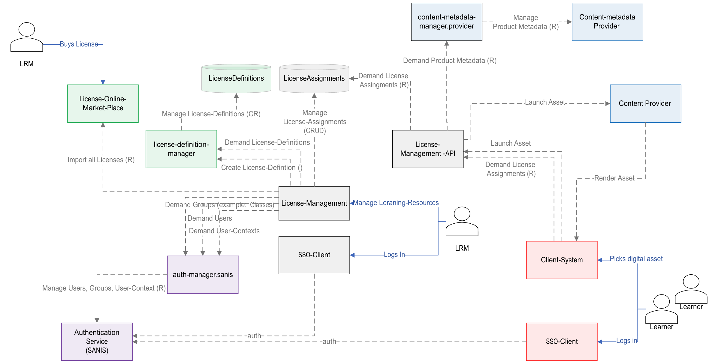

**This project incorporates elements from the open-source project [CLM](https://github.com/fraunhoferfokus/clm-core) to facilitate its functionality.**

# What is the License Management Component?

The developed concept of the license component aims to enable users to use digital educational content from providers in a legally secure manner, while at the same time meeting the requirements of education providers and schools. This component serves to model user rights to digital learning content and facilitates the exchange of data between the education providers' systems and the registration systems. This includes metadata systems for the representation of media, license marketplaces for the acquisition and administration of licenses and registration systems for schools and their users. 

## Architecture
The present illustration demonstrates how the concept of the license component aims to ensure legally secure access to educational content for users based on license agreements. The component supports the import of licenses, either through direct communication with a license marketplace or through initiation by the learning resource manager. These licenses can be synchronized via bilateral REST communication. Moreover, it is intended that the organizational structure of an educational institution will be aligned with the license component. This includes the integration of existing user accounts from various Identity Providers as well as the representation of the hierarchical organization structures during the license allocation.

To unlock full functionality, each service component has been developed as a microservice. This module is known as license-core.




## Reference Project

The [Control & Connect](https://www.fokus.fraunhofer.de/de/projekt/fame/control_connect_23-05) project, funded by the Federal Ministry of Education and Research (BMBF) under funding code 16INBI002C, tackled the problem of user-related license allocation in the German education sector. 

As part of the Fraunhofer FOKUS consortium, which acts as an exemplary implementer of the concept, three key partners have joined forces with the Verband der Bildungsmedien (VBM) , which represents the interests of school associations and publishers, and the n-21 state initiative, which has extensive expertise in the administration and coordination of school and organizational structures in Lower Saxony, in order to meet the challenges effectively.


## CC-LICENSE-CORE
The license core accesses other microservices to allow for license assignments and demand notifications in a GUI. Furthermore, this component verifies the legal consumption of individual users through their license assignments.

# Requirements:
* MariaDB Version 10x
* Redis Version 6x
* Node.js Version 20x
* Kecloak Version 18x
* [moin.schule](https://www.n-21.de/portal/seiten/moin-schule-900000111-10056.html) (OIDC) authentication service credentials 

# Quick Start:


Install node_modules in the respective git submodules with their respective dependencies by running: 

```npm install```

It is also necessary to copy .env.default file to .env and insert the appropriate values. Please contact the owner of this repository to the values. A description of the values is also given in the file itself.

(UNIX)
```cp .env.default .env.local```

The following table gives an overview of the settings you can change through the environment variables:

| Name                                | Example                                                                                                         | Required (Yes/No) | Description                                                                                                                   |
|-------------------------------------|-----------------------------------------------------------------------------------------------------------------|-------------------|-------------------------------------------------------------------------------------------------------------------------------|
| `MARIA_CONFIG`                      | `localhost\|3306\|test\|root\|12345`                                                                            | Yes               | Connection details for MariaDB, including host, port, database name, user, and password.                                      |
| `PORT`                              | `3000`                                                                                                          | Yes               | The port on which the service should be deployed.                                                                             |
| `NEXT_PUBLIC_DEPLOY_URL`            | `http://localhost/api`                                                                                          | Yes               | The URL where the front end of the application is deployed, used to make API calls.                                           |
| `NEXT_PUBLIC_SELF_URL`              | `http://localhost:3000/api`                                                                                     | Yes               | The URL where the service's own API is accessible, used for internal service-to-service communication.                        |
| `NEXT_PUBLIC_REDIRECT_URI`          | `http://localhost:3000/signIn`                                                                                  | Yes               | The URI for redirecting users after login or logout, used in OAuth2/OpenID Connect flows.                                     |
| `NEXT_PUBLIC_KEYCLOAK_CLIENT_ID`    | `license-core-local`                                                                                            | Yes               | The client ID for Keycloak authentication, necessary for Keycloak integration.                                                |
| `NEXT_PUBLIC_KEYCLOAK_AUTH_ENDPOINT`| `https://learning-services1.fokus.fraunhofer.de/realms/test/protocol/openid-connect/auth`                       | Yes               | The Keycloak authentication endpoint, required for initiating authentication with Keycloak.                                   |
| `NEXT_PUBLIC_IMPRESSUM_URL`         | `/imprint`                                                                                                      | No                | The URL for the legal notice or imprint page, typically required in some countries.                                           |
| `NEXT_PUBLIC_DATENSCHUTZ_URL`       | `/dataprotection`                                                                                               | No                | The URL for the data protection page, containing information on data handling and privacy.                                    |
| `DELETE_USE_CASE_EVERY_DAY`         | `false`                                                                                                         | No                | Indicates whether to delete license information and assignments daily at 00:00, for testing the license assignment process.    |
| `DEPLOY_URL`                        | `http://localhost:3000/api`                                                                                     | Yes               | The URL where APIs are hosted, central to accessing all microservices including the license core.                             |
| `GATEWAY_URL`                       | `http://localhost/api`                                                                                          | Yes               | The gateway URL for all hosted microservices, including the license core.                                                     |
| `REDIRECT_URI`                      |                                                                                                                 | Yes                | The URI used for OIDC redirection, necessary for authentication flows.                                                        |
| `KEYCLOAK_CLIENT_ID`                |                                                                                                                 | Yes                | The client ID for interacting with Keycloak, separate from the publicly exposed one.                                          |
| `KEYCLOAK_CLIENT_SECRET`            |                                                                                                                 | Yes               | The client secret for Keycloak authentication, necessary for secure interactions with Keycloak.                               |
| `KEYCLOAK_LOGOUT_URL`               |                                                                                                                 | Yes                | The URL for initiating logout in Keycloak, necessary for properly terminating sessions.                                       |
| `KEYCLOAK_TOKEN_ENDPOINT`           |                                                                                                                 | Yes               | The endpoint for obtaining tokens from Keycloak, part of the authentication process.                                          |
| `KEYCLOAK_EXCHANGE_TOKEN_ENDPOINT`  |                                                                                                                 | Yes                | The endpoint for token exchange in Keycloak, used for obtaining tokens with different scopes or for different clients.        |
| `SANIS_USERINFO_ENDPOINT`           |                                                                                                                 | Yes                | The endpoint for retrieving user information, likely part of an authentication or identity service.                           |
| `SANIS_CLIENT_ID`                   |                                                                                                                 | Yes                | The client ID for interacting with SANIS, if applicable, for authentication or data retrieval purposes.                       |
| `SANIS_CLIENT_SECRET`               |                                                                                                                 | Yes               | The client secret for SANIS, necessary for authenticated requests to SANIS services.                                          |
| `SANIS_TOKEN_ENDPOINT`              |                                                                                                                 | Yes                | The endpoint for obtaining tokens from SANIS, if using SANIS for authentication or authorization.                             |
| `REDIS_URL`                         | `redis://:12345@localhost:6379`                                                                                 | Yes               | The connection string for Redis, including password and port, for caching and session management.                             |
| `REDIS_SECRET`                      | `'keyboard cat'`                                                                                                | Yes               | The secret used by Redis for encryption, should be a secure, randomly generated string.                                       |


Afterward just startup the server with following command:

```npm run dev```

Afterwards you should be able to launch the application on the following address:

http://localhost:3000

# Structure

The LMC offers on one hand a lightweight backend application based on express and on the other hand a Next.js application to render server side pages

The project follows following structure

├── server.ts / # Entrypoint of the project where all routes are defined 
│ ├── express/ # based on a lightweight http server 
│ │ ├── models/ # The DAOs for interacting with the persistence layers
│ │ └── handlers/ # Responsible for handling the requests based on specific routes
│ ├── pages/ # Next.js pages which are used to display the frontend
│ │ 
│  
└── README.md # The file you're reading now


### Changelog

The changelog can be found in the [CHANGELOG.md](CHANGELOG.md) file.

## Get in touch with a developer

Please see the file [AUTHORS.md](AUTHORS.md) to get in touch with the authors of this project.
We will be happy to answer your questions at {clm@fokus.fraunhofer.de}

## License


The project is made available under the license in the file [LICENSE.txt](license.txt)
